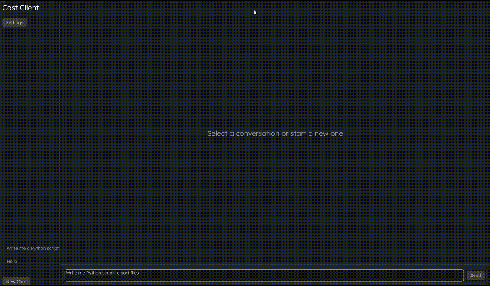

<div align="center">
  
  <h1>Cast Client</h1>
  <p>A Native AI Chat Client Written in Rust + egui</p>
</div>

## Features

- Streaming responses (SSE) with live markdown rendering
- Multiple conversations, persisted to disk
- Works with any OpenAI-compatible endpoint (Gemini, OpenAI, local models via
  Ollama, etc.) - not locked to one provider
- Single background thread for networking, not a full async worker pool
- GPU-accelerated UI via `egui`/`eframe`, no browser engine involved

## Seeing the App in action


## Memory footprint

| | Idle RAM |
|---|---|
| Gemini web app (Firefox tab) | ~580MB |
| OpenCode | ~670MB |
| Cast Client | ~110MB |

*Note*: These are just comparisons of memory usage Web app is much more capable than Cast and Open Code is just build for agentic coding. Cast is not trying to replace them.

## Building

```bash
cargo build --release
```
*Note*: mimalloc might require additional packages on Linux. Cast is not tested for Linux you can report any issues you encourter in the issues!
## Configuration

On first launch, open Settings and set:
- **Base URL** -- e.g. `https://generativelanguage.googleapis.com/v1beta/openai/`
  for Gemini
- **API Key**
- **Model** -- e.g. `gemini-3.5-flash`

Any OpenAI-compatible endpoint works!

## Why does this exist?

Well it all began when I was talking to Gemini and I saw my tab(only a single tab) in firefox uses 580mb of ram. That triggered something in me and I told myself I can do better than that. I already knew Rust but I had to learn egui and it was simpler than I anticipated. This app uses 110mb of ram(avg) on Win 11. While maybe I could have done better with something like FLTK, or even fully native gui's I really wanted to learn egui and cross-compatibility was a cherry on top.

So its here you can send PR's and Issue's for features you want and I'll merge/handle them other than that I really appreciate a star ⭐ maybe if this repo grows native apps will take of someday.


## License

GPL-3.0.
